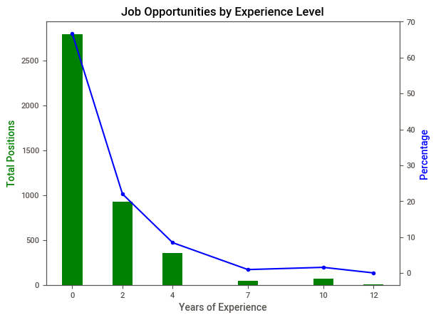
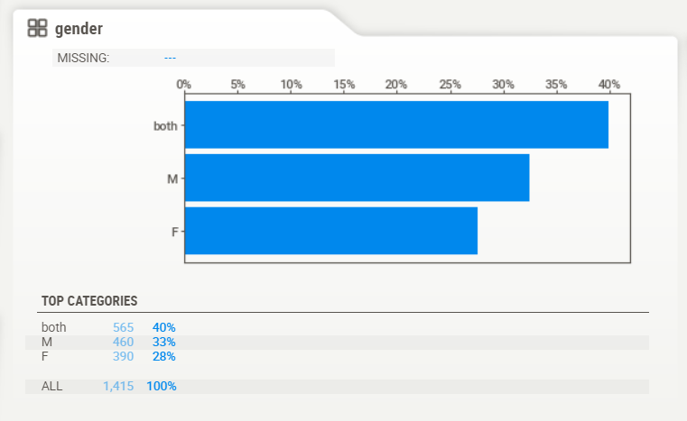
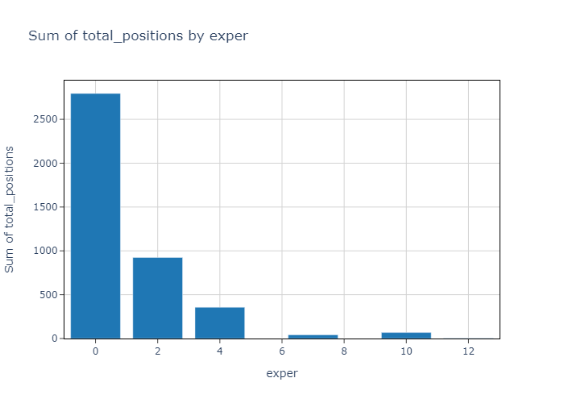
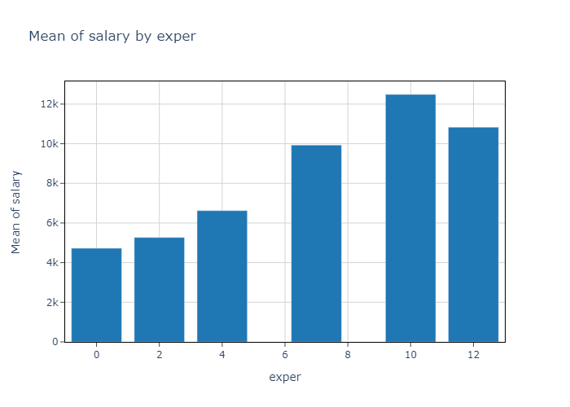
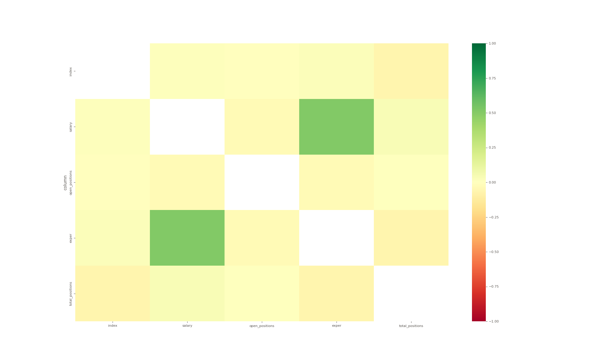

# Use-case-5: Jadarat Dataset

## Overview

This project is useful for students and professionals interested in analyzing employment trends and labor market dynamics in Saudi Arabia. The data can help identify areas of job growth, analyze required skills and qualifications, and assess gender representation. The dataset can also be beneficial for policymakers looking to promote job creation and economic growth. With this dataset, users can conduct research projects, generate data insights, and develop innovative solutions to employment challenges in Saudi Arabia.

[Explore the app](https://reyadgh-5.streamlit.app/)
[Explore the repo](https://github.com/ReyadGH/use-case-5-deployment)

## Questions

### 1. What proportion of job postings is attributed to each region within the kingdom?



**answer:** this graph shows the the sum of total opportunities for each

### 2. Is there a gender preference indicated in the job postings? within the kingdom?



**answer:** We can see that the males have higher job posting than the females (this is without considering the both category post)

### 3. What is the expected salary range for fresh graduates?


**answer:** we can see the range for fresh graduates (assuming the fresh graduates don't have experience)


**answer:** we can see the salary distribution for fresh graduates (assuming the fresh graduates don't have experience)

### 4. Are job opportunities predominantly targeted at individuals with experience, or is there room for fresh graduates as well?



**answer:** we can see here that most positions are targeting people with low experience

### Extra1. What is the average salary for each experience category



**answer:** we can see the mean salary for each category

### Extra2. How does the experience effect the salary?



**answer:** here we can see that the experience effect the salary by correlation of ~0.50

## About the Dataset

- **Source**: From Jadarat by Kaggle user
- **License**: CC0: Public Domain

## Data Profiling and Quality Checks

### Reliability

- **Source**: From Jadarat by Kaggle user
- **License**: CC0: Public Domain
- **Data Timeliness**: The dates in the dataset belong to 2022 (1444 Hijra)

### Timeliness

The dates in the dataset belong to 2022 (1444 Hijra), ensuring that the information is recent and relevant for analyzing current employment trends.

### Consistency

Consistency checks ensure that the data is uniformly formatted and follows expected patterns without contradictions.

### Relevance

Relevance checks determine whether the data is appropriate for the research questions and objectives.

### Uniqueness

Uniqueness checks ensure that there are no duplicate entries in the dataset.

### Completeness

Completeness checks verify that all necessary data points are present.

### Check Accuracy

Accuracy checks involve validating the data against known standards or external sources.

## Setup Instructions

1. Download the datasets from [Source Name](Source URL).
2. Ensure Python 3.x and necessary libraries ([List of lib used]) are installed.

   ```bash
   pip install numpy pandas matplotlib dtale hijridate datetime sweetviz
   ```

**_Riyadh Alghamdi_**
